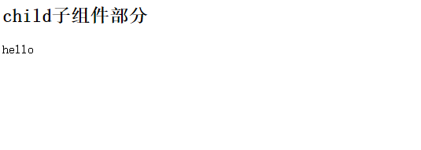
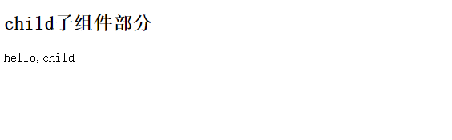

## vue组件之间传递值
### 父组件向子组件传值
#### App.vue起始界面
``` Vue.js
<template>
	<div id="app"></div>
</template>
<script>
export default {
    name:'app',
}
</script>
<style>
</style>
```
#### 父组件向子组件传值
1.创建子组件,在src/components/文件夹下新建一个Child.vue
2.Child.vue中创建props,然后创建一个名为message的属性
``` vue.js
<template>
	<div>
		<h2>child子组件部分</h2>
		<p>{{message}}</p>
	</div>
</template>
<script>
	export default {
        props:["message"]
	}
</script>
<style>
</style>
```
3.在App.vue中注册Child组件,并在template中加入child标签,标签中添加message属性并赋值
``` vue.js
<template>
	<div id="app">
		<child message="hello"></child>
	</div>
</template>

<script>
import child from './compoents/Child'
export default {
    name: 'app',
    components: {
        child
    }
}
</script>
<style>
</style>
```
4.保存修改的文件,查看浏览器

5.我们依然可以对message的值进行v-bind动态绑定
``` vue.js
<template>
	<div id="app">
		<child v-bind:message="parentMsg"></child>
	</div>
</template>

<script>
import child from './components/Child';
export default{
    name:'app',
    data() {
        return {
            parentMsg:"hello,child"
        }
    },
    components:{
        child
    }
}
</script>
<style>
</style>
```

#### 父组件向子组件传值成功的总结:
+ 子组件在props中创建一个属性，用以接收父组件传过来的值
+ 父组件中注册子组件
+ 在子组件标签中
+ 把需要传给子组件的值赋给该属性

### 子组件向父组件传值
#### 在子组件中创建一个按钮，给按钮绑定一个点击事件。
```
<template>
	<div>
		<h2>child子组件部分</h2>
		<p>{{message}}</p>
		<button v-on:click="sendMsgToParent">向父组件传值</button>
	</div>
</template>
<script>
	export default{
        props:["message"],
        methods:{
            sendMsgToParent:function(){
                
            }
        }
	}
</script>
<style>
</style>
```

#### 在相应该点击事件的函数名中使用$emit来触发一个自定义事件,并传递一个参数
```
<template>
	<div>
		<h2>child子组件部分</h2>
		<p>{{message}}</p>
		<button v-on:click="sendMsgToParent">向父组件传值</button>
	</div>
</template>
<script>
	export default{
        props:["message"],
        methods:{
            sendMsgToParent:function(){
                this.$emit("listenToChildEvent","this message is from child");
            }
        }
	}
</script>
<style>
</style>
```
#### 在父组件中的子标签中监听该自定义事件并添加一个响应事件的处理方法
```
<template>
	<div id="app">
		<child v-bind:message="parentMsg" v-on:listenToChidEvent="showMsgFromChild"></child>
	</div>
</template>
<script>
import child from './components/Child';
export default {
    name:'app',
    data() {
        return {
            parentMsg:"hello,child"
        }
    },
    methods:{
        showMsgFromChild:function(data){
            console.log(data);
        }
    }
}
</script>
<style>
</style>
```
#### 子组件向父组件传值成功总结:
+ 子组件需要以某种方式列如点击事件的方法来触发一个自定义事件
+ 将需要传的值作为$emit的第二个参数,该值将作为实参传给响应式自定义事件的方法
+ 在父组件中注册子组件并在子组件标签上绑定对自定义事件的监听